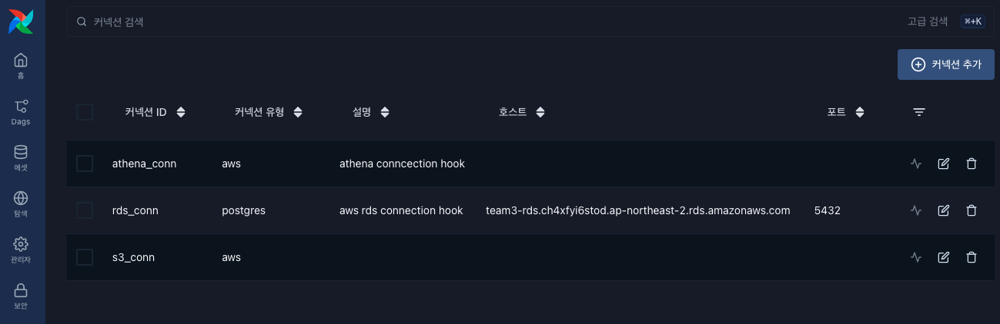
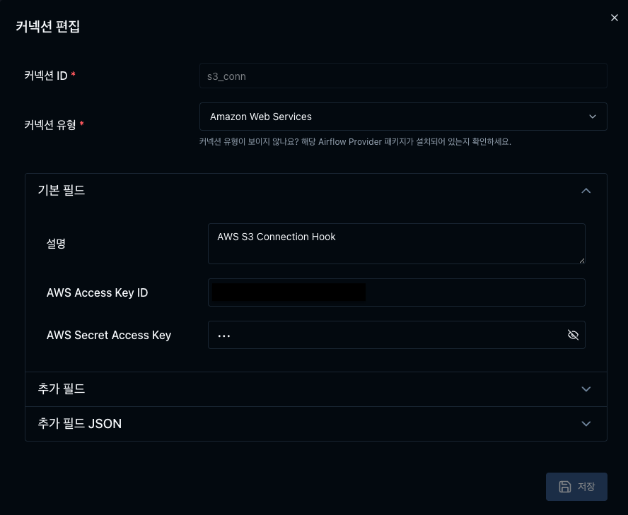
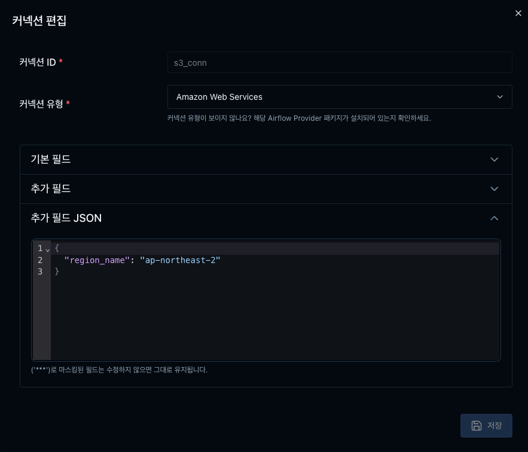
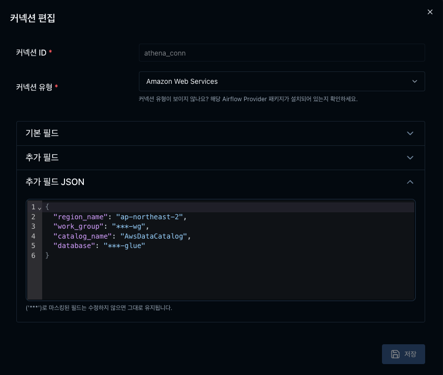
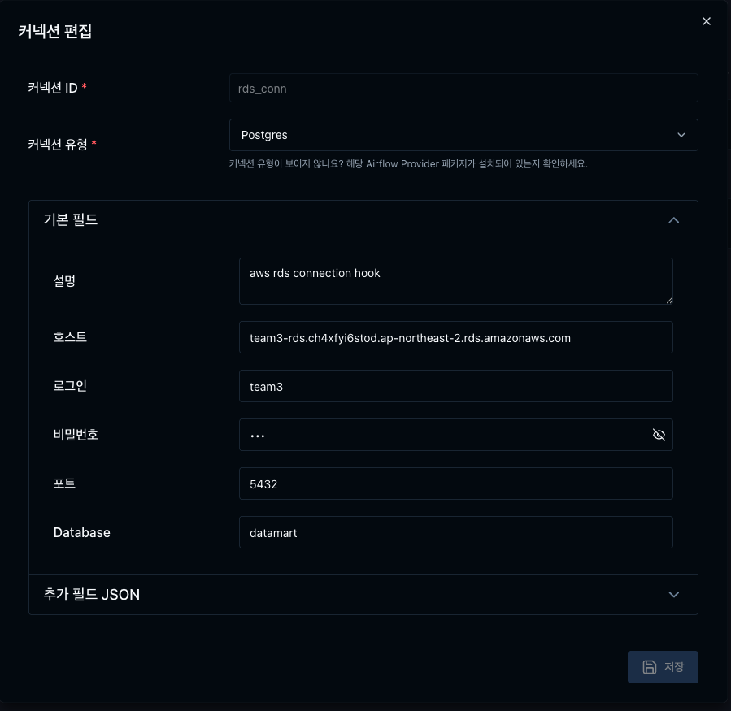

# 🔌 Airflow Connections 설정

본 아키텍처 구성에서 필수적으로 사용되는  
**Airflow Connection 설정 정보**를 설명합니다.

---

## 📑 목차
- [S3 Connection](#s3-connection)
- [Athena Connection](#athena-connection)
- [RDS Connection](#rds-connection)

<p align="center">
  
</p>

---

<a name="s3-connection"></a>
## 📦 S3 Connection

- 커넥션 ID: `s3_conn`  
  ⚠️ *변경 시 코드 내에서도 동일하게 수정 필요*
- 커넥션 유형: `Amazon Web Services`
- AWS Access Key ID: 개인 발급 정보 입력
- AWS Secret Access Key: 개인 발급 정보 입력
- 추가 필드 (JSON): 개인 발급 정보 입력

```json
{
  "region_name": "ap-northeast-2"
}
```
<p align="center">
    
    
</p>


<a name="athena-connection"></a>
## 🧮 Athena Connection

- 커넥션 ID: `athena_conn`   
  ⚠️ *변경 시 코드 내에서도 동일하게 수정 필요*
- 커넥션 유형: `Amazon Web Services`
- AWS Access Key ID: 개인 발급 정보 입력
- AWS Secret Access Key: 개인 발급 정보 입력
- 추가 필드 JSON: 개인 발급 정보 입력
```json
{
  {
  "region_name": "ap-northeast-2",
  "work_group": <필수수정>,
  "catalog_name": <필수수정>,
  "database": <필수수정>
}
}
```
<p align="center">
    
    
</p>


<a name="rds-connection"></a>
## 🗄️ RDS Connection

- 커넥션 ID: `rds_conn`   
  ⚠️ *변경 시 코드 내에서도 동일하게 수정 필요*
- 커넥션 유형: `Postgres`   
  ⚠️ *본 구성에서는 AWS RDS를 Postgres 엔진으로 사용*
- 호스트: RDS Endpoint
- 로그인: DB 계정 ID
- 비밀번호: DB 계정 비밀번호
- 포트: DB Port
- Database: Database 이름
<p align="center">
    
</p>